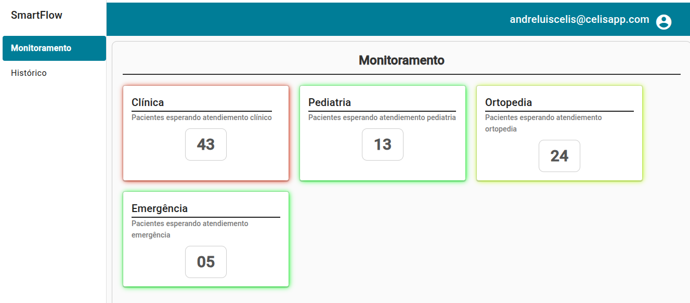

# 📊 Smart Flow 

**Smart Flow** é um projeto desenvolvido para otimizar o fluxo de pacientes em prontos-socorros, utilizando tecnologias modernas para proporcionar uma experiência eficiente e escalável. O foco do projeto é a integração com dispositivos **IoT (Internet das Coisas)**, permitindo a coleta e exibição de dados em tempo real a partir de sensores e câmeras inteligentes.

-----------------------------------------------------------------------------------------------


-----------------------------------------------------------------------------------------------

## 🚀 Tecnologias Utilizadas

- **Angular**: Framework para construção da interface de usuário.
- **AWS Amplify**: Plataforma para desenvolvimento de aplicações web e mobile com backend escalável.
- **TypeScript**: Linguagem de programação que adiciona tipagem estática ao JavaScript.
- **SCSS**: Linguagem de extensão do CSS para estilos mais organizados e reutilizáveis.
- **Angular Material**: Conjunto de componentes UI baseados no Material Design.
- **AWS Cognito**: Serviço de autenticação e autorização de usuários.
- **AWS AppSync**: Serviço para criação de APIs GraphQL escaláveis.
- **AWS DynamoDB**: Banco de dados NoSQL totalmente gerenciado.
- **IoT (Internet das Coisas)**: Coleta e envio de dados de sensores e câmeras inteligentes para monitoramento em tempo real.

## 📁 Estrutura do Projeto

```
pi-smart-flow-rp/
├── amplify/                 # Configurações do AWS Amplify
├── src/                     # Código-fonte da aplicação Angular
│   ├── app/                 # Componentes, serviços e módulos
│   └── assets/              # Recursos estáticos
├── .vscode/                 # Configurações do Visual Studio Code
├── amplify.yml              # Configuração de build do Amplify
├── angular.json             # Configuração do projeto Angular
├── package.json             # Dependências e scripts do projeto
└── README.md                # Documentação do projeto
```

## 🔧 Configuração e Execução

1. **Clone o repositório:**

   ```bash
   git clone https://github.com/AndreLuisCelis/pi-smart-flow-rp.git
   cd pi-smart-flow-rp
   ```

2. **Instale as dependências:**

   ```bash
   npm install
   ```

3. **Configure o AWS Amplify:**

   Certifique-se de ter o [AWS CLI](https://docs.aws.amazon.com/cli/latest/userguide/install-cliv2.html) e o [Amplify CLI](https://docs.amplify.aws/cli/start/install/) instalados.

   ```bash
   amplify init
   amplify pull
   ```

4. **Execute a aplicação:**

   ```bash
   ng serve
   ```

   Acesse a aplicação em `http://localhost:4200`.

5. **Aplicação na nuvem AWS**
   
   [ Smart Flow AWS ](https://main.d1681fg65sftyt.amplifyapp.com/home)

## 📄 Licença

Este projeto está licenciado sob a [MIT-0 License](LICENSE).


